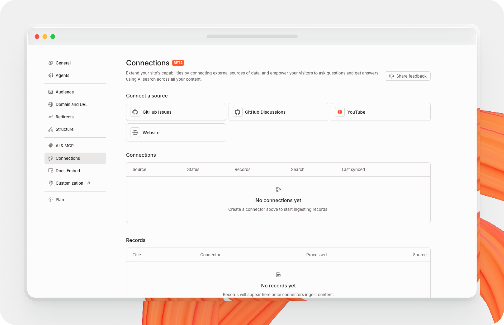

# Connections

Connections let you bring external content into your docs site.

Connected content can appear in [AI Search](ai-search.md) and [GitBook Assistant](gitbook-ai-assistant.md). Some connections can also help GitBook generate change requests.

To add a connection, open your site’s **Settings** and click on **Connections**.

<figure><figcaption></figcaption></figure>

### How connections work



### Connect a source

Select a source type. Then authorize it, or enter the URL you want GitBook to import.

Each connection creates a stream of records from that source, such as issues, discussions, pages, or videos.



### GitBook syncs records

After you save the connection, GitBook starts syncing records from that source.

In the connections list, you can review the sync status, record count, and last sync time.



### Choose how the records are used

For each connection, you can choose whether its records appear in search and GitBook Assistant, and whether they help GitBook generate change requests.

You can also adjust the connection’s search ranking to prioritize or deprioritize its records.



### Connection settings

When you edit a connection, you can configure these options:

#### Label

Use **Label** to give the connection a clear name.

This makes the source easier to identify in the connections list, especially if you connect multiple repositories, websites, or channels.

#### Auto-generate change requests


Auto generating change requests is currently in early access.&#x20;

See [agent-audit.md](agent-audit.md "mention") for information on requesting access


Turn on **Auto-generate change requests** to let GitBook learn from the connection’s records and suggest documentation updates.

GitBook can use those records to create change requests with suggested changes for your team to review.

#### Expose in search / assistant

Turn on **Expose in search / assistant** to make records from this connection searchable by visitors and available to answer questions.

This allows connected content to appear in your site’s AI-powered search experience and in GitBook Assistant responses.


Enabling **Expose in search / assistant** makes records from that connection available to anyone who can access the site — including external visitors if the site is shared externally.


#### Search ranking boost

Use **Search ranking boost** to prioritize or deprioritize records from a connection in search.

Increase the value if this source should appear more often. Lower it if this source should have less weight than your primary docs.
